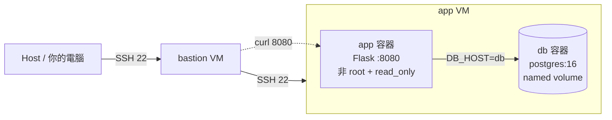

# 期末實作 — <412637273> <鍾珺如>

## 1. 架構總覽
<Mermaid 圖 + 一段話說明>

本實作建立在安全的跳板機（Bastion）底座上，外部 Host 無法直接對外接觸到 app VM。在 app VM 內部，我們採用宣告式的 Docker Compose 部署了一個獨立運行的雙服務 Stack。Web 應用層（Flask）與資料庫層（PostgreSQL）彼此透過 Docker 的內部橋接網路進行安全通訊，且 Web 容器完全以非 root 的權限階梯加固運行，而資料庫則透過具名的持久化硬碟碟區（Named Volume）維持狀態。

## 2. Part A：底座與基準點
<ssh 證據 + 版本 + snapshot>  
ssh 證據 + 版本  

snapshot  


## 3. Part B：Dockerfile 與快取
<Dockerfile + 兩次 build 對照>  
dockerfile  
```dockerfile
# ~/final/app/Dockerfile
FROM python:3.12-slim

WORKDIR /app

# 1. 先複製依賴宣告（極少變動，快取關鍵）
COPY requirements.txt .

# 2. 安裝依賴（--no-cache-dir 縮小鏡像體積）
RUN pip install --no-cache-dir -r requirements.txt

# 3. 安全加固：建立非 root 使用者與群組
RUN groupadd -g 1000 appuser && \
    useradd -r -u 1000 -g appuser appuser

# 4. 複製常變動的原始碼（放最後面，避免破壞前面的快取）
COPY app.py .

# 5. 切換成非 root 使用者執行
USER appuser

EXPOSE 8080

# exec form 啟動
CMD ["python", "app.py"]
   ```
兩次 build 對照  


### 為什麼聽 8080 不聽 80？  
答案（推理鏈）：  
在 Linux 的權限模型中，1024 以下的連接埠（如 HTTP 預設的 80 埠）屬於特權連接埠（Privileged Ports），只有具備系統最高權限的 root（UID 0）行程才能綁定監聽。  

本題為了落實生產化加固，在 Dockerfile 中使用了 USER appuser 指令，將容器內執行的權限降階為一般使用者（UID 1000）。非特權使用者如果嘗試綁定 80 埠，會觸發作業系統內核的權限拒絕（Permission denied）導致程式崩潰。因此，必須改用 1024 以上的非特權連接埠（例如 8080）才能讓服務正常啟動。  
## 4. Part C：Compose 與資料持久化
<compose.yaml 重點 + 三段對照>  
compose.yaml  
```
services:
  db:
    image: postgres:16
    container_name: final-db
    environment:
      POSTGRES_USER: ${POSTGRES_USER}
      POSTGRES_PASSWORD: ${POSTGRES_PASSWORD}
      POSTGRES_DB: ${POSTGRES_DB}
    volumes:
      - db-data:/var/lib/postgresql/data
    healthcheck:
      test: ["CMD-SHELL", "pg_isready -U postgres -d $${POSTGRES_DB}"]
      interval: 5s
      timeout: 3s
      retries: 10
      start_period: 10s
    restart: always

  app:
    build:
      context: ./app
      dockerfile: Dockerfile
    container_name: final-app
    ports:
      - "8080:8080"
    environment:
      DB_HOST: ${DB_HOST}
      DB_USER: ${DB_USER}
      DB_PASSWORD: ${DB_PASSWORD}
      DB_NAME: ${DB_NAME}
    depends_on:
      db:
        condition: service_healthy
    restart: always

volumes:
  db-data:
```
砍容器重建  
  
連 volume 一起砍  
  
重寫  


### down vs down -v

## 5. Part D：生產化加固
<權限驗證輸出 + cgroup 讀值對照表>  
權限驗證輸出  

cgroup 讀值對照表  


### yaml 的值怎麼對回 cgroup 檔案？
當我們在 compose.yaml 中宣告了資源限制後，Docker 底層會透過 Linux 核心的 cgroup v2 (Control Groups) 機制來實質限制容器。以下是從 /sys/fs/cgroup/ 控制檔案中所讀到的數值與 YAML 設定的完整轉換推理鏈：  
1. 記憶體限制驗證 (memory.max)  
核心控制檔讀值：268435456  
數值轉換推理：Linux 核心檔案內記錄的數據是以 Byte (位元組) 為單位。我們將其換算回兆位元組 (MiB)：  
$$268435456 \div 1024 \div 1024 = 256 \text{ MiB}$$  
對應結論：換算結果剛好精準對應到 compose.yaml 中所設定的 deploy.resources.limits.memory: 256m。  
2. CPU 算力限制驗證 (cpu.max)  
核心控制檔讀值：50000 100000  
數值轉換推理：cpu.max 包含兩個數字，格式為 $<quota> <period>$，單位皆為微秒 (microseconds, $\mu s$)：  
<period>：CPU 時間配額的週期，預設值 100000 微秒即代表 $100\text{ ms}$。  
<quota>：在該週期內，容器內所有程序被允許使用的最大 CPU 時間配額，此處為 50000 微秒（即 $50\text{ ms}$）。  
將兩者相除計算其算力比例：  
$$\frac{50000}{100000} = 0.5$$  
對應結論：代表該容器在一個週期內最多隻能壓榨單核 $50\%$ 的運算能力，完全符合 YAML 裡宣告的 cpus: "0.5"。  
3. 行程數量限制驗證 (pids.max)  
核心控制檔讀值：200  
數值轉換推理：pids.max 記錄的是 cgroup 內允許同時存在的最大 行程與執行緒總數 (Task Count)，不需經過複雜換算。  
對應結論：此絕對數值與 compose.yaml 中為了防止 Fork Bomb 攻擊所設定的 pids: 200 完全一致。  
總結取證意義：透過上述核心層數據的對照，足以證明 Docker Compose 的宣告式語法並非流於表面，而是確實驅動了 Linux 核心（Kernel）的 cgroup 機制，在最底層為生產環境提供了硬性的資源邊界加固。  
## 6. Part E：故障演練
### 故障 1：<F1–F4 擇一>
F1  
- 注入方式：在 app VM 執行 docker compose stop db  
- 故障前：* docker compose ps 顯示兩個容器皆為 Up (healthy)。  
    curl -s http://localhost:8080/ 回傳正常的學號與資料庫時間。  
- 故障中：  
curl -s http://localhost:8080/healthz 回傳 db unreachable: ... 且 HTTP 狀態碼為 503。  
約 30 秒內（經過 healthcheck 失敗判定後），docker compose ps 顯示 app 容器狀態變更為 Up (unhealthy)，但容器本身並未死掉（依舊是 Up）。  
- 回復後：  
執行 docker compose start db。  
等待數秒 db 回復健康後，app 的 healthcheck 重新過關，docker compose ps 恢復雙 (healthy)，網頁存取恢復正常。  
- 診斷推論：此實驗證明了 unhealthy != dead。當後端依賴（DB）斷線時，應用程式（Flask）本身行程依然存活並能回應外部請求，但應用層（Application Layer）的健康檢查路由偵測到內部邏輯異常，進而將狀態回報給容器編排層（Compose），這屬於典型的應用服務層級故障。  

故障前  
  
故障中  
  
回復後  
  

### 故障 2：<另一個>
F2  
- 注入方式：在 app VM 執行 docker compose stop app
- 故障前：* docker compose ps 顯示 app 容器為 Up (healthy)。  
curl -I http://localhost:8080/ 能正確回應 HTTP 200。  
- 故障中：
執行 curl http://localhost:8080/ 立即中斷並拋出 curl: (7) Failed to connect to localhost port 8080: Connection refused。  
docker compose ps 顯示 app 容器狀態為 Exited (0)。  
- 回復後：
執行 docker compose start app。  
容器重啟後狀態回到 Up (healthy)，curl 重新取得正確回應。  
- 診斷推論：當容器被停止後，核心（Kernel）中原本由該容器監聽的 TCP port 8080 被釋放。此時作業系統網路棧收到連線請求時，發現該埠口沒有任何 Socket 在進行監聽（Listen），因此網路層直接回傳 RST 封包，導致客戶端秒回 Connection refused。這屬於容器層/行程層級未啟動的故障。  

故障前  
  
故障中  
  
回復後  
  

### 三症狀分層表（必答）
| 症狀 | 最可能的層 | 第一條驗證命令 |
| ---- | ---------- | -------------- |
| timeout | 網路/防火牆層 (Network / UFW / Routing) | curl -iv http://localhost:8080/ |
| connection refused | 容器/行程監聽層 (Container / OS Socket) | docker compose ps 或 ss -tlnp |
| HTTP 503 | 應用程式/後端依賴層 (Application Logic / DB) | docker compose logs app |

## 7. 反思（200 字）
這學期從 VM 做到 production-ready 容器，「隔離」這個概念在 VM、namespace、
cgroup、權限階梯四個地方各出現一次——它們在防的東西一樣嗎？  
這學期從虛擬機一路做到生產化容器加固，我發現這四種「隔離」防範的核心痛點完全不同，形成了一套縱深防禦體系：

VM（虛擬機）： 防的是作業系統核心（Kernel）共享與硬體竊取。利用 Hypervisor 強制隔離出獨立的核心與虛擬硬體，防止惡意程式直接威脅到 Host 機與其他 VM 的安全。

Namespace（命名空間）： 防的是全域資源的可見性與碰撞。它在同一個 Kernel 上為容器拉起障眼法，讓容器以為自己擁有獨立的 PID 1、網路卡與 Mount 點，防止容器間互相窺探或干擾行程。

Cgroup（控制組）： 防的是資源流氓與拒絕服務攻擊（DoS）。它不防可見性，而是嚴格限制 CPU、記憶體與 PIDs 的使用上限，防止單一容器因程式失控（如 Fork 炸彈、記憶體洩漏）而拖垮整台 Host 機。

權限階梯（Non-root / Capability）： 防的是橫向移動與容器逃逸。它預設極小化權限（cap_drop: [ALL]），防範攻擊者即使透過應用程式漏洞（如 RCE）打進容器內部，也因為只是非 Root 且毫無 Capability 的邊緣角色，無法操作核心系統，徹底斷絕其搞壞系統或逃逸至 Host 的機會。
## 8. Bonus（選做）
