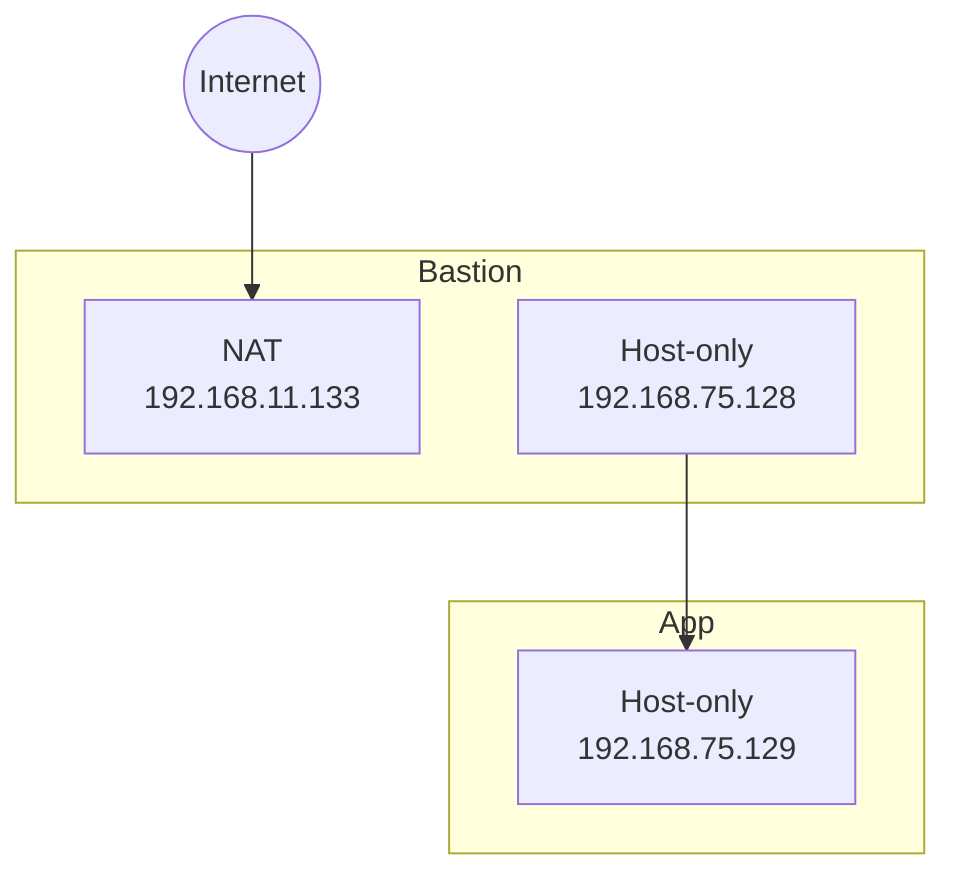

# 期中實作 — <412637273> <鍾珺如>

## 1. 架構與 IP 表
<Mermaid 圖 + 表格>

| VM          | 網卡            | 對外           | 對內           | 角色     |
| ----------- | --------------- | -------------- | -------------- | -------- |
| `bastion` | NAT + Host-only | 收 Host 的 SSH | 轉送到 `app` | 唯一入口 |
| `app`     | Host-only only  | 無             | 跑 nginx 容器  | 實際服務 |

## 2. Part A：VM 與網路
<命令 + 關鍵輸出>

bastion ip

app ip

bastion ping

app ping

## 3. Part B：金鑰、ufw、ProxyJump
<防火牆規則表 + ssh app 成功證據>
| VM      | 規則                                  | 說明          |
| ------- | ----------------------------------- | ----------- |
| bastion | allow 22/tcp                        | 允許外部 SSH    |
| bastion | deny all                            | 拒絕其他連線      |
| app     | allow from 192.168.75.128 to 22/tcp | 僅允許 bastion |
| app     | deny all                            | 拒絕其他        |

## 4. Part C：Docker 服務
<systemctl status docker + curl 輸出>

## 5. Part D：故障演練
### 故障 1：<F1/F2/F3 擇一>
F1：網路介面禁用
- 注入方式：app：sudo ip link set ens33 down
- 故障前：  
  檢查命令：ip link show ens33  
  輸出：顯示 state UP，且 Host 端可正常 ssh  
  app  
  
  Host  
  

- 故障中：  
  故障注入：sudo ip link set ens33 down  
  檢查命令：ip link show ens33  
  輸出：顯示 state DOWN  
  症狀：Host 端執行 ssh app 出現 Connection timed out，ping 無回應  
  app  
  
  Host  
  

- 回復後：  
  回復注入：sudo ip link set ens33 up  
  檢查命令：ip link show ens33  
  輸出：顯示 state UP  
  驗證：Host 端 SSH 恢復連線  
  app  
  
  Host  
  

- 診斷推論：  
  Host 端 ping 不通，代表基礎網路層 (L3) 斷聯。  
  檢查 App 端 ip link 發現狀態為 DOWN，確認為實體介面被禁用。  
  此故障導致封包無法從網卡進出，故呈現連線逾時。  

### 故障 2：<另一個>
F3：Docker 服務停止
- 注入方式：sudo systemctl stop docker/sudo systemctl stop docker docker.socket  
- 故障前：  
  檢查命令：systemctl status docker  
  輸出：顯示 Active: active (running)  
  驗證：執行 docker ps 可列出運行中的容器  
  app  
  
  Host  
  

- 故障中：  
  故障注入：sudo systemctl stop docker/sudo systemctl stop docker docker.socket  
  檢查命令：sudo docker ps  
  輸出：Cannot connect to the Docker daemon at unix:///var/run/docker.sock. Is the docker daemon running?  
  症狀：Host 端 可以正常 SSH 登入，但無法操作 Docker  
  sudo systemctl stop docker  
  app  
  
  Host  
  
  
  sudo systemctl stop docker docker.socket  
  app  
  
  Host  
  

- 回復後：  
  命令：sudo systemctl start docker/sudo systemctl start docker docker.socket  
  輸出：systemctl status docker 恢復為 active (running)  
  驗證：docker ps 恢復正常  
  sudo systemctl start docker  
  app  
  
  Host  
  
  
  sudo systemctl start docker docker.socket  
  app  
  
  Host  
  

- 診斷推論：  
  Host 端能透過 SSH 登入，代表 L2/L3/L4 網路層與防火牆完全正常。  
  執行 docker ps 報錯，指向特定的應用服務 (Service) 失效。  
  透過 systemctl 發現服務為 inactive，確認故障層級在應用層而非網路層。  

### 症狀辨識（若選 F1+F2 必答）
兩個都 timeout，我怎麼分？

## 6. 反思（200 字）
這次做完，對「分層隔離」或「timeout 不等於壞了」的理解有什麼改變？  
網路排錯中 「Timeout 不代表機器壞了，而是溝通在某一層斷了」。  
在 F1 演練中，介面關閉導致 ssh timeout，這時主機在網路上徹底消失，連基礎的 ping 都無法回應。  
但在 F3 演練中，我發現即便 docker ps 報錯，我依然能透過 SSH 順利登入。  
這讓我明白「分層隔離」的診斷價值：SSH 的通暢代表了 L2 物理層到 L4 傳輸層都是好的，問題被限縮在「應用服務層」。  
這次經驗改變了我過往的排錯習慣。現在我知道，當遇到連線問題時，應先用 ping 檢查路徑（L3），再用 telnet/nc 測試端口（L4），最後才進系統看 systemctl 狀態（Service）。  
理解這些層級的差異，讓我能從混亂的報錯訊息中，快速定位出到底是「路不通」還是「冰箱沒電」。  
## 7. Bonus（選做）
